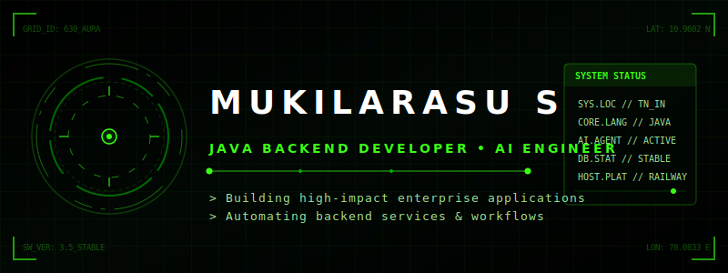
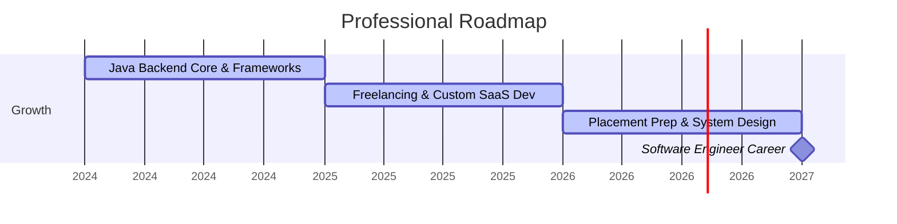

# 
🔮 WELCOME TO MY DEVELOPMENT TERMINAL 🔮

  

  

  
  
  
  

---

### 🧬 About Me

I am a final-year **B.Tech Information Technology** student at **VSB Engineering College, Karur** (CGPA: **8.1/10**), specializing in building high-performance Java backend services, automating complex workflows, and integrating artificial intelligence into production systems. 

*   💼 **Practical Experience:** Completed internships at **Hero MotoCorp Ltd.** (R&D Division) and **IBM** (AI & Automation).
*   🚀 **Freelance Work:** Architected and deployed production SaaS products, Visual workflow systems, and commercial automation engines for retail clients.
*   🤖 **Focus Area:** Clean code, robust API architecture, background task scheduling, database optimization, and multi-agent AI systems.

---

### 🛠️ Technical Skill Matrix

<table width="100%">
  <tr>
    <td valign="top" width="50%">
      <h4>☕ Languages & Core</h4>
      
      
      
      
      
      
    </td>
    <td valign="top" width="50%">
      <h4>🚀 Backend & Frameworks</h4>
      
      
      
      
      
      
    </td>
  </tr>
  <tr>
    <td valign="top" width="50%">
      <h4>🤖 AI & Automation</h4>
      • **LLM API Integration:** Anthropic Claude, OpenAI, Groq 
      • **Agents:** Autonomous Visual Workflows, LangChain 
      • **Bots:** Telegram Bot API, WhatsApp Web.js, Baileys 
      • **Headless Tools:** Puppeteer (Automated PDF/Reports)
    </td>
    <td valign="top" width="50%">
      <h4>☁️ DevOps & Databases</h4>
      
      
      
      
      
      
    </td>
  </tr>
</table>

---

### 📂 Premium Featured Projects

#### 🌐 [Zora — The Autonomous Agent Grid](https://github.com/Mukil630/Zora)
*A visual, node-based automation workflow builder designed to wire together and manage autonomous AI agents.*
- **Tech Stack:** React 18, TypeScript, Vite, Node.js Express, Prisma ORM, PostgreSQL, Zustand, Stripe, Docker.
- **Highlights:** Drag-and-drop workspace canvas, visual log step-by-step execution tracking, plain-English error helper, Stripe subscriptions, and multi-LLM (Claude/OpenAI) agent node workers.

#### 💬 [Botify — WhatsApp SaaS Platform](https://github.com/Mukil630/Botify)
*A multi-tenant SaaS application allowing business owners to deploy customized, AI-driven WhatsApp support agents.*
- **Tech Stack:** Flask, Node.js, `whatsapp-web.js` (Puppeteer session runner), Groq LLM, PostgreSQL, Railway.
- **Highlights:** QR-code linking mechanism, automated appointment scheduling, tiered subscription billing limits, and business info customization for context-aware customer support.

#### 🛍️ [Aura (SAIVI Collection) — Telegram-Managed Store](https://github.com/Mukil630/clothing-store)
*An ultra-modern, glassmorphic streetwear storefront backed by a real-time inventory management Telegram Bot.*
- **Tech Stack:** Vite, React, Node.js Express, Telegram Bot API.
- **Highlights:** Dynamic catalog rendering with category filters. Integrated admin bot commands allowing store owners to upload new catalog photos, edit stock descriptions, and receive immediate checkout alerts.

#### 🖥️ [SGC Billing — Desktop Invoice App](https://github.com/Mukil630/nexus-desktop)
*A desktop-based billing and invoice generation application with cloud synchronization.*
- **Tech Stack:** Electron, React.js, Puppeteer, Google Drive API (OAuth 2.0).
- **Highlights:** Fast invoice creation forms, automated headless PDF generation, and secure, direct cloud synchronization to Google Drive.

#### 🤖 [AI Billing Automation Bot](https://github.com/Mukil630)
*An intelligent Telegram bot designed to automate receipt and invoice processing for retail clients.*
- **Tech Stack:** Python, Groq LLM, Telegram Bot API, Google Sheets API.
- **Highlights:** Extracts structured JSON data from handwritten bill images, auto-generates invoice sheets, and updates client database registers with tax validation.

---

### 📅 Experience Timeline

---

### 📊 Coding Analytics & Activity

  
  

  

  

---

### 🐍 Contribution Snake

  

---

  <i>"Automating complex operations. Building responsive interfaces. Engineering AI for the future."</i>

