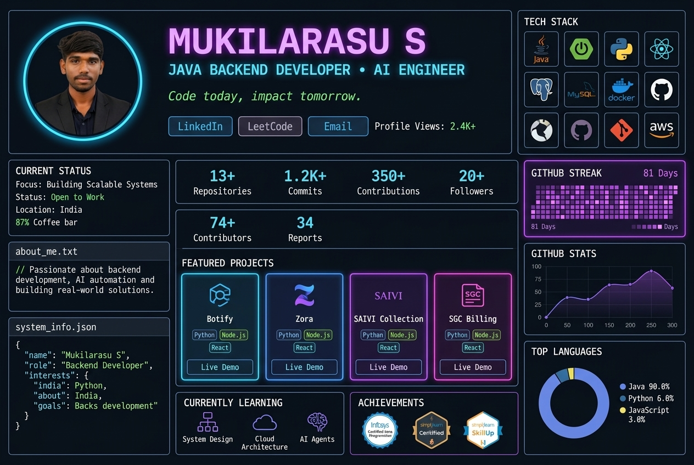

# 
⚡ WELCOME TO MY DEVELOPMENT PORTFOLIO DASHBOARD ⚡

  

  

  
  
  
  

---

### 🧬 About Me

I am a final-year **B.Tech Information Technology** student at **VSB Engineering College, Karur** (CGPA: **8.1/10**), with hands-on experience in AI, automation, and full-stack development. 

*   💡 **My Philosophy:** Building production-ready, scalable applications and intelligent agents that solve real-world business challenges.
*   💼 **Practical Experience:** Completed internships at **Hero MotoCorp Ltd.** (R&D Division) and **IBM** (AI & Automation).
*   🚀 **Freelance Work:** Successfully shipped multiple freelance systems including multi-tenant SaaS platforms, desktop billing software, and custom bot solutions.

---

### 🛠️ Technical Skill Matrix

<table width="100%">
  <tr>
    <td valign="top" width="50%">
      <h4>💻 Languages & Core</h4>
      
      
      
      
    </td>
    <td valign="top" width="50%">
      <h4>🚀 Backend & Frameworks</h4>
      
      
      
      
      
    </td>
  </tr>
  <tr>
    <td valign="top" width="50%">
      <h4>🗄️ Databases</h4>
      
      
    </td>
    <td valign="top" width="50%">
      <h4>☁️ Tools & Platforms</h4>
      
      
      
      
    </td>
  </tr>
</table>

---

### 📂 Featured Projects

#### 💬 [Botify – AI-Powered WhatsApp Bot SaaS (Freelance)](https://github.com/Mukil630/Botify)
*A production-ready multi-tenant SaaS platform enabling businesses to deploy custom AI-powered WhatsApp bots.*
- **Tech Stack:** Flask, Node.js, Groq LLM, PostgreSQL, Railway.
- **Key Features:** Supports context-aware AI chat automation, appointment booking, tiered subscription models, and an admin dashboard.

#### 💳 [SGC Billing – Desktop Invoice Application (Freelance)](https://github.com/Mukil630)
*A desktop-based billing and invoice creation system for retail clients.*
- **Tech Stack:** Electron, React, Puppeteer, Google Drive API.
- **Key Features:** Interactive React forms for invoice entries, automated headless PDF invoice compilation with Puppeteer, and secure cloud sync to Google Drive via OAuth.

#### 🤖 [Personal AI Assistant (Jarvis) (Personal Project)](https://github.com/Mukil630)
*A voice-controlled desktop virtual assistant automating local tasks.*
- **Tech Stack:** Python, Speech Recognition, Text-to-Speech (TTS), System APIs.
- **Key Features:** Triggers voice-based conversations, performs web searches, executes OS automation commands, and handles system scripts.

#### 📝 [AI Billing Automation Bot (Freelance)](https://github.com/Mukil630)
*An intelligent Telegram-based billing system that processes handwritten invoices.*
- **Tech Stack:** Python, Groq LLM API, Telegram Bot API, Cloudinary.
- **Key Features:** Uses LLM vision to extract structured JSON data from handwritten bill images, auto-matches customers, uploads receipts to Cloudinary, and delivers digital invoices to clients.

#### 📧 [Gmail Automation Agent (Personal Project)](https://github.com/Mukil630)
*An AI automation agent overseeing calendar schedules and inbox correspondence.*
- **Tech Stack:** Python, Gmail API, Google Calendar API.
- **Key Features:** Drafts intelligent context-aware replies to emails, schedules events, triggers task reminders, and structures automated mail workflows.

---

### 💼 Internships

- **Hero MotoCorp Ltd. — Research & Development Intern (1 Month)**
  *Gained practical exposure to engineering workflows, automotive research, and product development processes.*
- **IBM — AI & Automation Weekend Internship (2026)**
  *Completed a hands-on curriculum covering core AI concepts, automation pipelines, and intelligent system applications.*

---

### 🏆 Certifications

- 🏅 **AI & Automation** — Full Course Completion (2025)
- 🏅 **AI & ML Made Easy: From Basic to Advanced** — Udemy (2025)
- 🏅 **Demystifying Networking** — NPTEL (2025)
- 🏅 **Infosys Certified Java Programmer** — Infosys (2024)
- 🏅 **AI Agents for Beginners** — Simplilearn SkillUp (2026)

---

### 📊 Coding Analytics & Activity

  

  
  

  

  

  

---

### 🐍 Contribution Snake

  

---

  <i>"Automating complex operations. Building responsive interfaces. Engineering AI for the future."</i>

