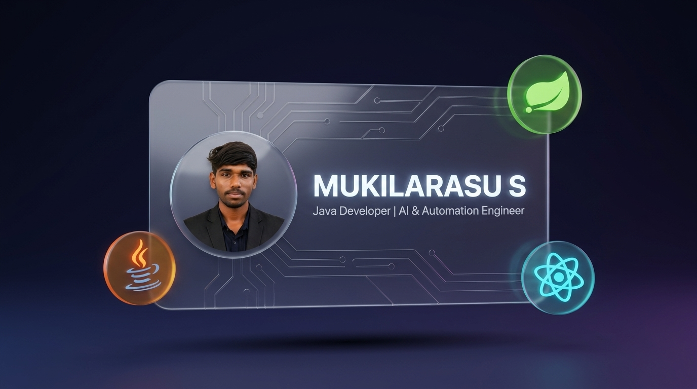

  

  

  
  
  
  
  

---

### 🧬 Terminal Telemetry & System Profile

<table width="100%" border="0" cellspacing="0" cellpadding="0">
  <tr>
    <td width="42%" valign="top" align="center">
       
      
    </td>
    <td width="58%" valign="top">
      <pre>
<code>
⚡ mukil@jarvis-core:~$ cat developer_profile.yaml
---------------------------------------------------------
[SYSTEM IDENTITY]
Name         : Mukilarasu S (Mukil)
Role         : Java Backend & AI Automation Engineer
Location     : Karur, Tamil Nadu, India
Status       : 🟢 Active & Building Production Code

[EDUCATION & CREDENTIALS]
Degree       : B.Tech Information Technology
College      : VSB Engineering College, Karur (2023 - 2027)
CGPA         : 8.1 / 10
Certificated : Infosys Certified Java Programmer
Networking   : NPTEL Certified - Demystifying Networking

[CORE ARCHITECTURE FOCUS]
• Java Spring Boot Microservices & RESTful API Engineering
• Autonomous AI Agent Workflows (ReAct, LangChain, Groq, OpenAI)
• Full-Stack SaaS Platforms & Electron Desktop Apps
---------------------------------------------------------
</code>
      </pre>
    </td>
  </tr>
</table>

#### 💡 Philosophy & Background
I am a final-year **B.Tech Information Technology** student passionate about constructing enterprise-grade Java backends and intelligent autonomous AI agents. Whether structuring multi-tenant SaaS platforms or engineering voice-controlled AI systems like **JARVIS**, my objective is building reliable, scalable software that solves real business challenges.

- 🎓 **Academic Standing**: VSB Engineering College (2023 – 2027) | **CGPA: 8.1 / 10**
- ☕ **Backend Focus**: Building secure, high-throughput microservices using **Spring Boot**, JPA/Hibernate, and structured REST APIs.
- 🤖 **AI & Automation**: Designing multi-step cognitive reasoning agents (ReAct), integrating vision LLMs for OCR invoice parsing, and automating workflows.
- 🏢 **Industry Exposure**: Completed Research & Development Internship at **Hero MotoCorp Ltd.** and virtual AI Internship with **IBM**.

---

### 🛠️ Core Engineering Skill Matrix

<table width="100%">
  <tr>
    <td valign="top" width="50%">
      <h4>☕ Languages & CS Foundations</h4>
      
      
      
      
      
    </td>
    <td valign="top" width="50%">
      <h4>🤖 AI, LLM & Automation</h4>
      
      
      
      
      
    </td>
  </tr>
  <tr>
    <td valign="top" width="50%">
      <h4>🚀 Backend & Frontend Frameworks</h4>
      
      
      
      
      
    </td>
    <td valign="top" width="50%">
      <h4>🗄️ Databases & Cloud Tools</h4>
      
      
      
      
      
    </td>
  </tr>
</table>

---

### 📂 Featured Systems & Deployments

#### 🤖 [JARVIS – Autonomous Voice & System Automation Agent](https://github.com/Mukil630)
*An intelligent voice-controlled desktop agent with multi-step cognitive reasoning.*
- **Tech Stack:** Python, Express, Web Speech API, ReAct Agent Loop, System APIs
- **Key Features:** Features hands-free voice synthesis, terminal command execution, web telemetry, long-term memory store, and a real-time HTML5 audio frequency spectrum analyzer.

#### 💬 [Botify – AI-Powered WhatsApp Bot SaaS Platform](https://github.com/Mukil630/Botify)
*Production-ready multi-tenant SaaS enabling businesses to deploy customized AI WhatsApp assistants.*
- **Tech Stack:** Flask, Node.js, Groq LLM API, PostgreSQL, Railway Deployment
- **Key Features:** Supports context-aware AI chat automation, appointment booking, tiered subscription management, and an administrative control dashboard.

#### 📄 [Freelance OCR & LLM Invoice Billing System](https://github.com/Mukil630)
*An automated Telegram-based billing pipeline for handwritten bill recognition.*
- **Tech Stack:** Python, Tesseract OCR, Groq LLM Vision, Telegram Bot API, Cloudinary
- **Key Features:** Uses LLM vision to extract structured JSON data from handwritten bill photos, auto-matches customer profiles, uploads receipts to Cloudinary, and delivers digital invoices with 98%+ accuracy.

#### 💳 [SGC Billing – Desktop Invoice Application](https://github.com/Mukil630/sgc-billing)
*Cross-platform desktop invoicing system for retail and business clients.*
- **Tech Stack:** Electron, React, Puppeteer, Google Drive API (OAuth 2.0)
- **Key Features:** Interactive React invoicing interface, automated headless PDF generation with Puppeteer, and encrypted cloud sync to Google Drive.

#### ⚡ [Agentic AI Workflow Automation Platform](https://github.com/Mukil630)
*Autonomous multi-agent task planning and execution engine.*
- **Tech Stack:** Python, OpenAI / Groq LLM, LangChain Tool Bindings
- **Key Features:** Autonomous goal decomposition, tool selection, error self-correction, and background execution.

---

### 💼 Professional Experience

- **Hero MotoCorp Ltd. — Research & Development Intern (1 Month)**
  - Gained hands-on experience in automotive R&D workflows, product testing, engineering validation, and industrial design pipelines.
- **IBM — AI & Automation Virtual Intern (2026)**
  - Completed intensive curriculum on enterprise AI architecture, automation pipelines, and intelligent system deployment models.

---

### 🏆 Accredited Certifications

- 🏅 **Infosys Certified Java Programmer** (Infosys, 2024) — Official accreditation for advanced Java application development.
- 🏅 **Demystifying Networking** (NPTEL, 2025) — Certified in core Computer Networking architecture & TCP/IP protocols.
- 🏅 **AI & ML Made Easy: Basic to Advanced** (Udemy, 2025) — Machine learning models, algorithms, and system integration.
- 🏅 **AI Agents for Beginners** (Simplilearn SkillUp, 2026) — Autonomous AI agent workflows and prompt engineering.

---

### 📊 Coding Analytics & Activity

  

  
  

  

  

---

### 🐍 Contribution Grid Snake

  

---

  <i>"Automating complex operations. Building responsive interfaces. Engineering AI for the future."</i>

