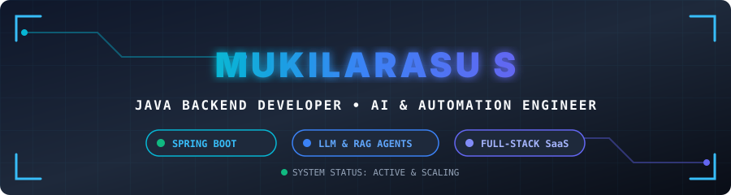

<p align="center">
  
</p>

<p align="center">
  
</p>

<p align="center">
  <a href="https://mukil630.github.io/MUKIL_PORTFOLIO/"></a>
  <a href="https://linkedin.com/in/mukilarasu-s-333771302"></a>
  <a href="https://leetcode.com/u/Mukil55"></a>
  <a href="mailto:mukilarasu55@gmail.com"></a>
  <a href="https://wa.me/919080030538"></a>
  
</p>

---

### ⚡ Executive Engineering Summary

I am a final-year **B.Tech Information Technology** student at **VSB Engineering College, Karur** (CGPA: **7.9 / 10**), specializing in **Enterprise Java Backend Architecture** and **Autonomous AI Systems Engineering**.

```java
public class MukilarasuS extends SoftwareEngineer {
    private final String developer   = "MUKILARASU S";
    private final String location    = "Karur, Tamil Nadu, India";
    private final String education   = "B.Tech IT @ VSB Engineering College (Class of 2027)";
    private final String[] coreStack = {
        "Enterprise Java & Spring Boot Backends",
        "Autonomous AI Multi-Agent RAG Pipelines",
        "Cross-Platform SaaS & Desktop Engineering",
        "High-Throughput PostgreSQL & Database Optimization"
    };

    public void executionPhilosophy() {
        System.out.println("Automating complex workflows. Engineering scalable, production-ready applications.");
    }
}
```

* ☕ **Enterprise Java & Backend Architecture:** Experienced in building production-grade Java backends utilizing **Spring Boot**, microservices, JPA/Hibernate, Spring Security, and RESTful APIs.
* 🤖 **AI & Automation Systems:** Integrating Large Language Models (LLMs) like Groq, Claude, and OpenAI into event-driven workflows, vector databases, and multi-tenant AI agents.
* 📦 **Full-Stack & Desktop SaaS:** Constructing cross-platform desktop interfaces with **Electron** & **React**, and deploying multi-tenant SaaS structures on **Railway** & **Vercel**.
* 📚 **CS Foundations:** Strong mastery in Data Structures & Algorithms (DSA) in Java, Relational Database Management Systems (DBMS), and Computer Networks.

<p align="left">
  
</p>

---

### 🛠️ Technical Skill Matrix

<table width="100%">
  <tr>
    <td valign="top" width="50%">
      <h4>💻 Languages & Core</h4>
      
      
      
      
      
    </td>
    <td valign="top" width="50%">
      <h4>🚀 Backend & Frameworks</h4>
      
      
      
      
      
    </td>
  </tr>
  <tr>
    <td valign="top" width="50%">
      <h4>🗄️ Databases & AI Tech</h4>
      
      
      
      
    </td>
    <td valign="top" width="50%">
      <h4>☁️ Cloud & Tools</h4>
      
      
      
      
      
    </td>
  </tr>
</table>

---

### 🚀 Production & Freelance Platforms

#### 💬 [Botify – AI-Powered WhatsApp Bot SaaS](https://github.com/Mukil630/Botify)
*Production multi-tenant SaaS platform enabling businesses to deploy custom AI-powered WhatsApp bots.*
- **Tech Stack:** Flask, Node.js, Groq LLM API, PostgreSQL, Railway.
- **Key Features:** Context-aware AI chat automation, appointment booking, tiered subscription models, and interactive admin control panel.

#### 🌐 [VIZRO Vertex Solutions](https://vizro.vercel.app/)
*Custom software agency platform showcasing full-stack client software deployments.*
- **Tech Stack:** React, Node.js, Tailwind CSS, Vercel.
- **Key Features:** Interactive client portal, custom web application architecture, and automated lead management.

#### 💳 [SGC Billing – Retail Invoice Desktop System](https://github.com/Mukil630/sgc-billing)
*Cross-platform desktop application for retail invoicing, inventory management, and automated receipt generation.*
- **Tech Stack:** Electron, React, Puppeteer, Google Drive API.
- **Key Features:** Dynamic billing entry forms, headless PDF compilation via Puppeteer, and secure OAuth cloud sync to Google Drive.

#### 🎂 [The Dream Elevate Store](https://github.com/Mukil630/DREAM_ELEVATES)
*High-converting e-commerce bakery ordering platform.*
- **Tech Stack:** HTML5, CSS3, JavaScript, Supabase.
- **Key Features:** Real-time product catalog, custom cake order booking forms, and automated database sync.

#### 👗 [The Saivi Collection Boutique](https://github.com/Mukil630/saivi-collection)
*Boutique fashion e-commerce store for clothing and jewellery.*
- **Tech Stack:** React, Node.js, Supabase.
- **Key Features:** Responsive mobile-first UI, cart state management, and real-time inventory tracking.

---

### 💼 Work Experience & Internships

- **Hero MotoCorp Ltd. — Research & Development Intern (1 Month)**
  *Gained practical exposure to engineering testing workflows, automotive R&D, and product development processes.*
- **IBM — AI & Automation Weekend Intern (2026)**
  *Completed specialized curriculum on enterprise AI architecture, robotic process automation, and cognitive agents.*

---

### 🏆 Engineering Certifications

- 🏅 **Infosys Certified Java Programmer** — Infosys (2024)
- 🏅 **AI & Automation — Full Course Completion** (2025)
- 🏅 **Demystifying Networking** — NPTEL (2025)
- 🏅 **AI & ML Made Easy: From Basic to Advanced** — Udemy (2025)
- 🏅 **AI Agents for Beginners** — Simplilearn SkillUp (2026)

---

### 📊 Engineering Activity & Analytics

<p align="center">
  
  
</p>

<p align="center">
  
</p>

<p align="center">
  
</p>

<p align="center">
  
</p>

---

<p align="center">
  <i>"Building production-ready, scalable applications and intelligent agents that solve real-world business challenges."</i>
</p>
